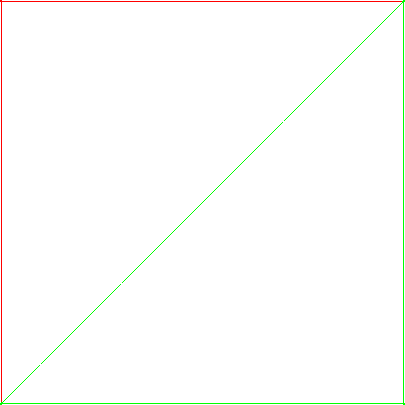

# PolyBot

This page describes the PolyBot project,
the second project for GEI-LP (2020 edition). Your task
is to implement a Telegram Bot that replies textually and graphically
to operations related to convex polygons.


## Introduction: Convex polygons

A convex polygon is a simple polygon in which all its interior angles are
strictly less than 180°. In the following picture, all polygons are convex,
excepting one. Guess which one.


A polygon has *n* vertices and *n* edges. A polygon is said to be *regular*
when all edges have the same length. In the picture we have two regular
polygons. Can you identify them?

There are several operations that can be done with polygons. Here we mention
some examples:

**Convex hull:** Given a set of points, we can calculate the smallest convex
polygon that contains the set.


**Intersection:** The intersection of two convex polygons is a convex polygon,
as shown in the figure.


**Convex Union:** Given two convex polygons, the convex union is the smallest
convex polygon that contains both polygons. Equivalently, it is the convex
hull of both polygons.

**Bounding box:** Given a set of convex polygons, find the smallest bounding
box that encloses all polygons.


(notice that polygons with a huge number of vertices look like circles in the
(figure).

**Inside:** We can check whether a convex polygon is inside another convex
polygon.


For convenience, we will consider some particular cases of polygons
(not always recognized as polygons by mathematicians!):

* Empty polygon: a polygon with zero vertices.
* Monogon: a polygon with one vertex (a point).
* Digon: a polygon with two vertices (a segment).

The remaining polygons are more conventional: triangles,
quadrilaterals, pentagons, hexagons, etc.


## Part 1: Class for convex polygons

The first part of the project consists of designing and implementing a Python
class named `ConvexPolygon` to represent and manipulate convex polygons.

The class should define, at least, the following operations:

* Construct a convex polygon given by the coordinates of a set of points.
* Check whether a point is inside another convex polygon.
* Check whether a convex polygon is inside another convex polygon.
* Get the number of vertices and edges of a convex polygon.
* Get the length of the perimeter of a convex polygon.
* Get the area of a convex polygon.
* Get the coordinates of the centroid of a convex polygon.
* Check if a convex polygon is regular.
* Compute the intersection of two convex polygons.
* Compute the convex union of two convex polygons.
* Compute the bounding box of a convex polygon.
* Draw convex polygons (with colors) in a PNG image.

Several decisions will have to be taken in the design of the class `ConvexPolygon`:

* Internal representation of a convex polygon.
* Specification and documentation of its public operations.
* Private operations.
* Algorithms to perform the required operations efficiently (remember, *n*log*n* is better than *n²*).
* Set of test examples to check the functionality of the class.

Please try to offer a rich, useful and well documented
API for this class. Use constants, constructors,
optional parameters with sensible default values, methods, static methods,
docstrings...

You cannot use third party libraries to solve this part, except the PIL/pillow library
to draw the PNG images.


**Hint.**
In order to represent a convex polygon made of a set of points, we strongly
suggest that you maintain a list of the points on the convex hull of the set.
This list should always have non-repeated points and they should be ordered
clockwise taking the leftest point as a reference. Lists with 0, 1 and 2
points should be accepted.


**In a hurry?** If you are struggling with the implementation of the
intersection operation, you can fake it by using the convex union operation
instead. Of course, your results will be wrong but, al least, you will be able
to continue coding your project. The penalization will be 1 point (over 10) in
the grade.


## Part 2: A programming language to work with convex polygons

The second part of this project consists in designing and implementing
a small programming language to work with convex polygons. You have
to solve this part using ANTLR with Python and the `ConvexPolygon` class.

This is a sample script showcasing the desired programming language:

```
// sample script
p1 := [0 0  0 1  1 1  0.2 0.8]
color p1, {1 0 0}
print p1
area p1
perimeter p1
vertices p1
centroid p1

print "---"

p2 := [0 0  1 0  1 1]
color p2, {0 1 0}
print p2
equal p1, p2
inside p1, p2
inside [0.8 0.2], p2

draw "image.png", p1, p2

print "---"

print p1 + p2                           // convex union
print p1 * p2                           // intersection
print #p2                               // bounding box
equal p1 + p2, #p2                      // complex operations
p3 := #((p1 + p2) * [0 0  1 0  1 1])    // complex operations

r := !100                               // convex polygon made with 100 random points
```

and this is the corresponding output:

```
0.000 0.000 0.000 1.000 1.000 1.000
0.500
3.414
3
0.333 0.667
---
0.000 0.000 1.000 1.000 1.000 0.000
no
no
yes
---
0.000 0.000 0.000 1.000 1.000 1.000 1.000 0.000
0.000 0.000 1.000 1.000
0.000 0.000 0.000 1.000 1.000 1.000 1.000 0.000
yes
```

where the file `image.png` contains




An informal specification of the commands is given bellow.
It is assumed that all polygons are convex polygons given by
a set of points.


### Comments

Two bars (`//`) introduce a comment up to the end of the line.


### Polygon identifiers

Identifiers are as usual:
`p`, `Q`, `p1`, `p2`, `pol_gr`, ...


### Points and polygons

Points in the commands are given by two pairs of real numbers, in standard
notation, to denote the X and Y coordinates. For instance, `0 0` or `3.14
-5.5`. When printed, all real numbers must be formatted with three digits
after the decimal dot.


### Colors

Colors in the commands are given, between curly braces, by three real numbers
in [0,1], in standard notation, to denote the RGB color. For instance, `{0 0
0}` denotes black, `{1 0 0}` denotes red, and `{1 0.64 0}` denotes orange.


### The assigment command

The assignment command (`:=`) associates an variable with a convex polygon.
If the polygon identifier is new, it will create it. If it already existed, it
will overwrite the previous polygon. New polygons are black by default. It is
an error to use a variable not yet defined.


### The `print` command

The `print` command prints a given polygon or a text.

- For polygons, the output must only contain the vertices in the convex hull of the
polygon, in clockwise order, starting from the vertex will lower X (and the
vertex with lower Y in case of ties).

- For texts, the text is given as a string of (simple) characters between quotes.


### The `area` command

The `area` command prints the area of the given polygon.


### The `perimeter` command

The `perimeter` command prints the perimeter of the given polygon.


### The `vertices` command

The `vertices` command prints the number of vertices of the convex hull of the
given polygon.


### The `centroid` command

The `centroid` command prints the centroid of the given polygon.


### The `color` command

The `color` command associates a color to the given polygon variable.


### The `inside` command

Given two polygons, the `inside` command prints `yes` or `no` to tell whether
the first is inside the second or not.


### The `equal` command

Given two polygons, the `equal` command prints `yes` or `no` to tell whether
the two polygons are the same or not.


### The `draw` command

The `draw` command draws a list of polygons in a PNG file, each one with its
associated color. The image should be of 400x400 pixels, with white background
and the coordinates of the vertices should be scaled to fit in the 398x398
central part of the image, while preserving the original aspect ratio.


### Operators

`*` represents the intersection of two polygons.

`+` represents the convex union of two polygons.

`#` is the unary operator that returns the bounding box of a polygon
(it computes a new polygon with the four vertices corresponding to the
bounding box of the given polygon).

`!n` is an operator that (applied to a natural number `n`)
returns a convex polygon made with `n` points drawn at random in the unit square
([0,1]²).


### Errors

For the sake of simplicity, you may assume that all the inputs are valid.


### Additional features

Your project may add new additional commands, provided they are dully
documented. Of course, these commands must be compatible with the required
syntax.


## Part 3: A bot to interact with convex polygons

The third and final part of this project consists in implementing
a Telegram Bot that allows the user to work with convex polygons
from its phone. The Bot should simply read commands in the programming
language and print (or draw) the corresponding results.


# Lliurament


Heu de lliurar la vostra pràctica al Racó. Només heu de lliurar un fitxer ZIP
que, al descomprimir-se generi:
- Un fitxer `requirements.txt` amb les llibreries que utilitza el vostre projecte
  - vegeu, per exemple, https://pip.pypa.io/en/stable/user_guide/#requirements-files.
- Un fitxer `README.md` que el documenti
  - vegeu, per exemple, https://gist.github.com/PurpleBooth/109311bb0361f32d87a2.
- Un fitxer `polygons.py` que contingui la classe de polígons.
- Una carpeta `cl` amb el contingut de la part de compiladors.
- Una carpeta `bot` amb el contingut de la part del chatbot
  - l'arxiu principal s'ha de dir `bot.py`

Els vostres fitxers de codi en Python han de seguir les regles d’estı́l PEP8,
tot i que podeu oblidar les restriccions sobre la llargada màxima de les lı́nies.
Podeu utilitzar el paquet pep8 o http://pep8online.com/ per assegurar-vos
que seguiu aquestes regles d’estı́l. L’ús de tabuladors en el codi queda prohibit
(zero directe).

El termini de lliurament és el **dilluns 11 de gener a les 23:59**.

Per evitar problemes de còpies,
no pengeu el vostre projecte en repositoris públics.


## Llibreries

Utilitzeu les llibreries de Python següents:

- `python-telegram-bot` per interactuar amb Telegram.
- `pillow` per dibuixar PNGs.

Podeu utilitzar lliurament altres llibreries estàndards de Python però, si no
són estàndards, heu de demanar permís als vostres professors (que segurament
no us el donaran).


## Referències

- Gràfics simples en Python. Salvador Roura. 2020.
https://lliçons.jutge.org/grafics/
- Bots de Telegram. Jordi Petit. 2020.
https://lliçons.jutge.org/python/telegram.html
- Càlcul de l'envolupant convexa: Jordi Cortadella. 2020.
Transpes 56 a 62 de https://www.cs.upc.edu/~jordicf/Teaching/AP2/pdf/03_AlgorithmAnalysis.pdf
- Càlcul de la intersecció de polígons convexos. Stackoverflow.
https://stackoverflow.com/questions/13101288/intersection-of-two-convex-polygons


